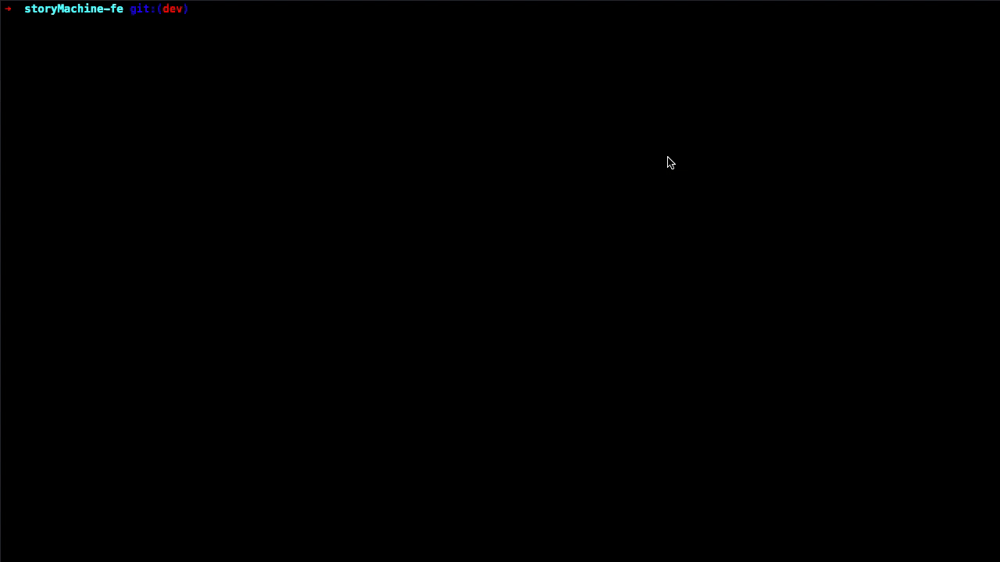

# gotag 指定文件夹打tag至git仓库


[](https://github.com/huarxia/gotag/issues) [](https://github.com/huarxia/gotag/network) [](https://github.com/huarxia/gotag/stargazers) [](https://github.com/huarxia/gotag/blob/master/LICENSE)

### 

### 安装使用

------

##### 1. 全局安装

`$ npm install gotag -g`

##### 2. 局部安装

`$ npm install gotag -S`

### 配置

------

##### 1. package.json 中配置

```json
"disTag": {
    "type": "git",
    "repo": "https://github.com/huarxia/blog.git",
    "dir": "static",
    "user": "huarxia", // 选填
    "email": "huaxia@huar.love"  // 选填
}
```

### 2. fix 瓦力构建系统更新不到tag

必须新建一个分支，分支名起为 `disTag` 中配置的 `dir` 的`value` 值

### 3. 参数

- type `非必填` 只是标明是git类型
- repo `必填`  远程git仓库

- dir `非必填`  需要打tag的目录 建议填写，因为该工具就是解决特殊打tag问题，不填写会默认将当前所有文件进行tag

### 命令操作方法

------

##### 1. 全局安装使用命令

`gotag -t xxx -m xxx`

其中：

 - `-t xxx` 中 `xxx` 代表 `tag` 名称
 - `-m xxx` 中 `xxx` 代表 `tag ` 注释

> -t -m 是必须参数

### 2. 局部安装使用命令

```json
// package.json
"scripts": {
    "tag": "gotag"
}
```

当前项目根路径中

```shell
$ npm run tag -- -t xxx -m xxx
```
